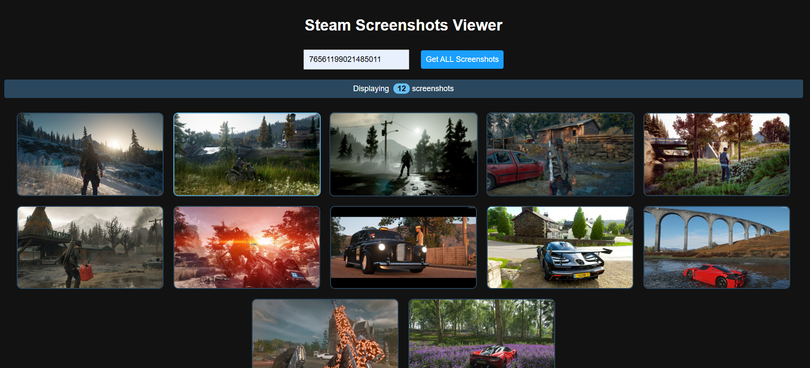

# Steam-User-Screenshots-Using-Scrapping

   

Steam Screenshots Viewer is a web application that allows users to view all publicly available Steam screenshots of a given Steam ID. The project includes both a frontend for displaying the images and a backend for fetching them from Steam Community.

## 🚀 Features
- Fetches and displays all screenshots associated with a Steam ID
- Progress bar indicating the loading status
- Responsive UI with animations for a smooth experience
- Error handling for private profiles or incorrect Steam IDs

## 📁 Project Structure
```
Steam-Screenshots-Viewer/
│-- index.html        # Frontend HTML, CSS, and JavaScript
│-- server.mjs        # Backend server to fetch screenshots (Express.js)
│-- server2.mjs       # Alternative backend with enhanced pagination support
```

## 🛠️ Installation & Setup

### Prerequisites
- Node.js (Ensure you have Node.js installed)
- A Steam profile with publicly accessible screenshots

### Backend Setup
1. Clone the repository:
   ```sh
   git clone https://github.com/kingslayer458/Steam-Screenshots-Viewer.git
   cd Steam-Screenshots-Viewer
   ```
2. Install dependencies:
   ```sh
   npm install express cors node-fetch
   ```
3. Start the server:
   ```sh
   node server.mjs  # Or node server2.mjs (for enhanced pagination support)
   ```
4. The backend runs on `http://localhost:3000`.

### Frontend Setup
1. Open `index.html` in a browser.
2. Enter a valid Steam ID and click "Get ALL Screenshots".
3. The application fetches and displays all public screenshots.

## ⚙️ How It Works
1. **Frontend (index.html)**:
   - Accepts user input (Steam ID).
   - Sends a request to the backend API (`/screenshots/:steamID`).
   - Displays the retrieved images dynamically with animations.
   
2. **Backend (server.mjs or server2.mjs)**:
   - Scrapes Steam Community for screenshot links.
   - Extracts image URLs and returns them as JSON.
   - Handles pagination and profile privacy restrictions.

## 🚧 Work in Progress
- Adding a UI to allow users to filter screenshots by game.
- Improving error messages and API response times.
- Implementing caching for frequent requests.

## 📜 License
This project is open-source under the MIT License.

---
⚡ **Contributions are welcome!** Feel free to open issues or pull requests.
